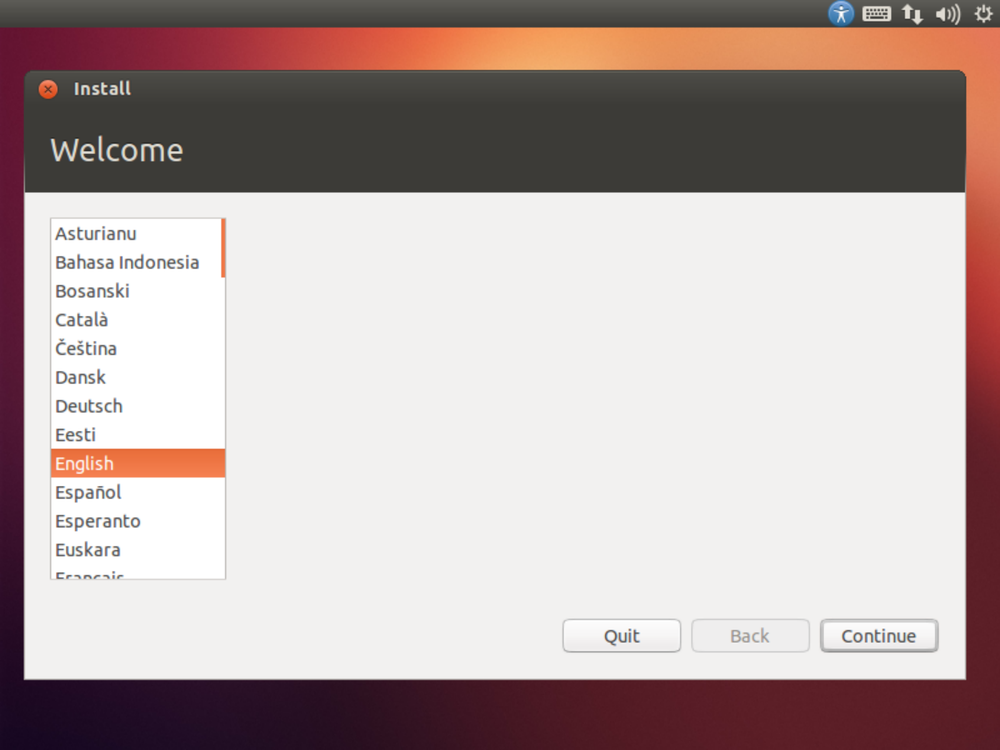
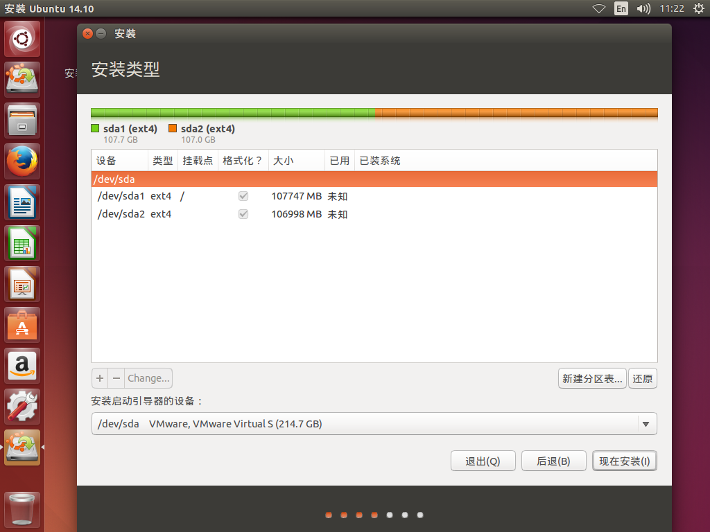
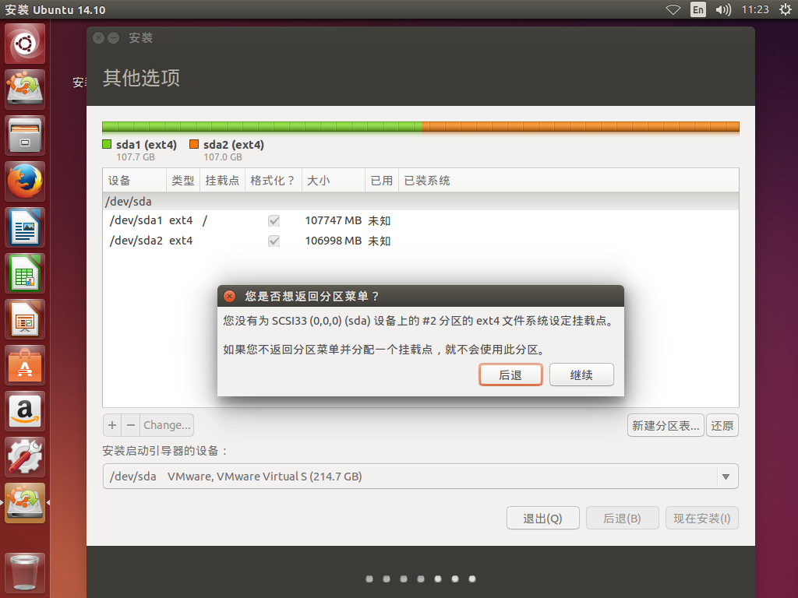

<!-- TOC depthFrom:1 depthTo:6 withLinks:1 updateOnSave:1 orderedList:0 -->

- [准备基本环境](#%E5%87%86%E5%A4%87%E5%9F%BA%E6%9C%AC%E7%8E%AF%E5%A2%83)
	- [ubuntu 12.10 x86安装](#ubuntu-1210-x86%E5%AE%89%E8%A3%85)
	- [其他Ubuntu碰到的问题](#%E5%85%B6%E4%BB%96ubuntu%E7%A2%B0%E5%88%B0%E7%9A%84%E9%97%AE%E9%A2%98)
	- [apt源](#apt%E6%BA%90)
	- [修改root密码](#%E4%BF%AE%E6%94%B9root%E5%AF%86%E7%A0%81)
	- [安装openssh-server](#%E5%AE%89%E8%A3%85openssh-server)
	- [软件安装](#%E8%BD%AF%E4%BB%B6%E5%AE%89%E8%A3%85)
	- [参考博客](#%E5%8F%82%E8%80%83%E5%8D%9A%E5%AE%A2)

<!-- /TOC -->
# 准备基本环境


## ubuntu 12.10 x86安装

<http://old-releases.ubuntu.com/releases/12.10/>

下载链接:<http://old-releases.ubuntu.com/releases/12.10/ubuntu-12.10-desktop-i386.iso>

强烈建议使用 ubuntu-12.10-desktop-i386.iso 系统镜像，其他镜像容易造成编译出错等问题。
所使用的源码其实也不完善，但是高版本编译器容易检测出问题。





一定要选择*其它选项**，也就是手动分区。







* 建议两个分区，一个根分区，一个无挂载点ext类型分区。至于swap分区，只有用到的时候用文件搞一个就行，不需要创建。
* swap分区如果给内存足够没多大必要，但是有些程序就只会死皮赖脸要swap分区才行，为了省麻烦
* 不需要开启逻辑卷，lvm毕竟需要驱动支持，后期可以玩玩，新手稳妥点弄点基础的


* 虚拟机记得做快照还原点


## 其他Ubuntu碰到的问题

* 不建议使用其他Ubuntu发行版，尤其那种非长期支持TLS，首先源不一定有，然后编译通不过，尴尬至极
* 这个版本gcc还是存在许多漏洞，但是刚好这个特定发行版妥妥支持，不会报错。如果你想采坑，去吧~


## apt源

* 由于版本太老，国内的所有源站点都不支持该版本
* Ubuntu提供了一个站点作为老版本Ubuntu更新源
* 12.10版本代号 quantal

<http://old-releases.ubuntu.com/ubuntu/>

修改/etc/apt/sources.list

```
deb http://old-releases.ubuntu.com/ubuntu/ quantal-updates main restricted
deb-src http://old-releases.ubuntu.com/ubuntu/ quantal-updates main restricted
```

修改之后更新apt源数据

```
sudo apt-get clean all
sudo apt-get clean
sudo apt-get update
```

## 修改root密码


切换到root，修改root密码

## 安装openssh-server

```
sudo apt-get update -y
sudo apt-get install openssh-server -y
```

修改sshd配置，允许root登录。。好吧，这个版本不需要修改


默认允许root登录。xshell登录搞起耍~~


## 软件安装


```
 apt-get install xserver-xephyr libgtk-3-dev libgmp-dev libmpc-dev libmpfr-dev lrzsz screen gawk libtool screen ccache -y
```


## 参考博客

<https://blog.csdn.net/jiangwei0512/article/details/52824708>
<http://blog.163.com/wflk_wangwei/blog/static/2788833720144352959686/>
