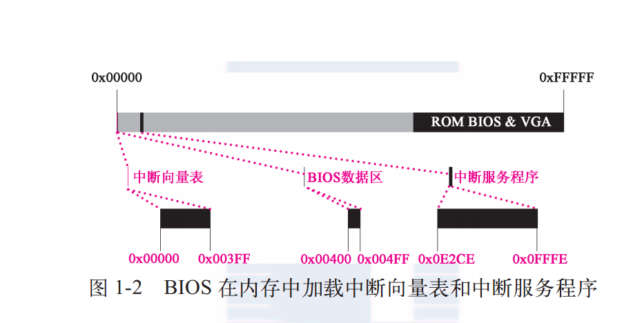
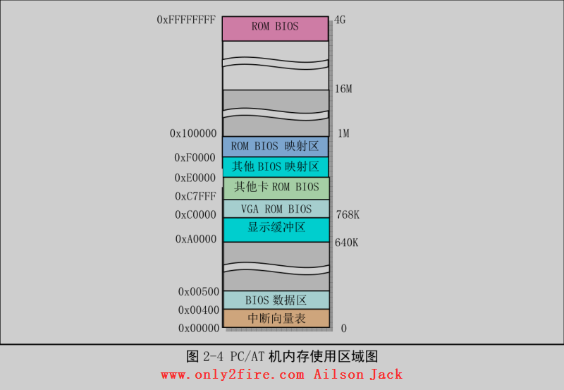
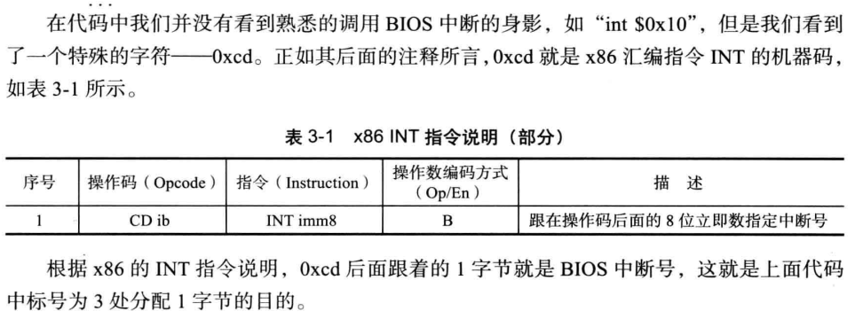
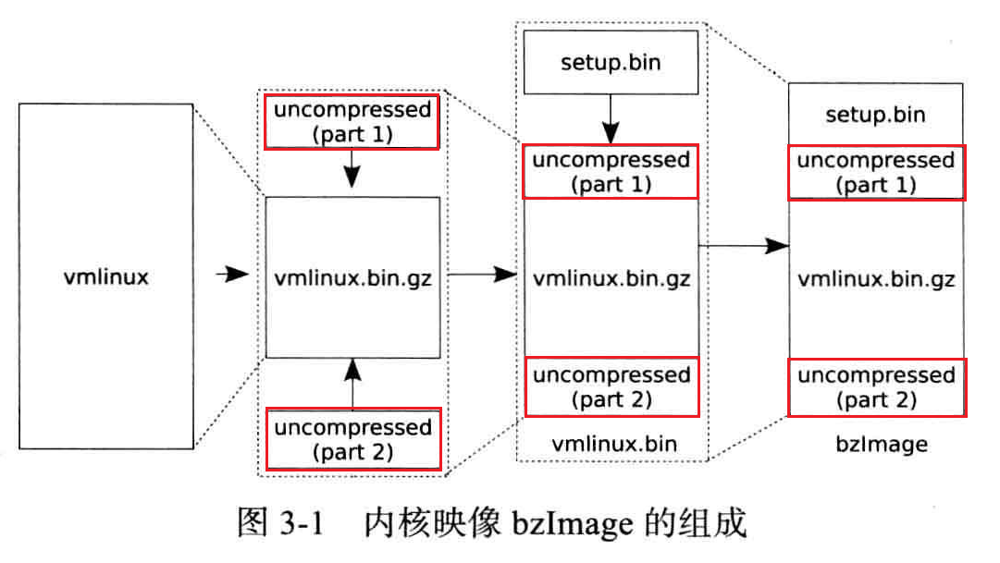

<!-- TOC -->

- [内核映像组成](#%E5%86%85%E6%A0%B8%E6%98%A0%E5%83%8F%E7%BB%84%E6%88%90)
  - [一级推进系统](#%E4%B8%80%E7%BA%A7%E6%8E%A8%E8%BF%9B%E7%B3%BB%E7%BB%9F)
  - [二级推进系统](#%E4%BA%8C%E7%BA%A7%E6%8E%A8%E8%BF%9B%E7%B3%BB%E7%BB%9F)
  - [有效载荷](#%E6%9C%89%E6%95%88%E8%BD%BD%E8%8D%B7)
  - [映像格式](#%E6%98%A0%E5%83%8F%E6%A0%BC%E5%BC%8F)

<!-- /TOC -->

# 内核映像组成


## 一级推进系统


boot_params结构

```
/* The so-called "zeropage" */
struct boot_params {
	struct screen_info screen_info;			/* 0x000 */
	struct apm_bios_info apm_bios_info;		/* 0x040 */
	__u8  _pad2[4];					/* 0x054 */
	__u64  tboot_addr;				/* 0x058 */
	struct ist_info ist_info;			/* 0x060 */
	__u64 acpi_rsdp_addr;				/* 0x070 */
	__u8  _pad3[8];					/* 0x078 */
	__u8  hd0_info[16];	/* obsolete! */		/* 0x080 */
	__u8  hd1_info[16];	/* obsolete! */		/* 0x090 */
	struct sys_desc_table sys_desc_table; /* obsolete! */	/* 0x0a0 */
	struct olpc_ofw_header olpc_ofw_header;		/* 0x0b0 */
	__u32 ext_ramdisk_image;			/* 0x0c0 */
	__u32 ext_ramdisk_size;				/* 0x0c4 */
	__u32 ext_cmd_line_ptr;				/* 0x0c8 */
	__u8  _pad4[116];				/* 0x0cc */
	struct edid_info edid_info;			/* 0x140 */
	struct efi_info efi_info;			/* 0x1c0 */
	__u32 alt_mem_k;				/* 0x1e0 */
	__u32 scratch;		/* Scratch field! */	/* 0x1e4 */
	__u8  e820_entries;				/* 0x1e8 */
	__u8  eddbuf_entries;				/* 0x1e9 */
	__u8  edd_mbr_sig_buf_entries;			/* 0x1ea */
	__u8  kbd_status;				/* 0x1eb */
	__u8  secure_boot;				/* 0x1ec */
	__u8  _pad5[2];					/* 0x1ed */
	/*
	 * The sentinel is set to a nonzero value (0xff) in header.S.
	 *
	 * A bootloader is supposed to only take setup_header and put
	 * it into a clean boot_params buffer. If it turns out that
	 * it is clumsy or too generous with the buffer, it most
	 * probably will pick up the sentinel variable too. The fact
	 * that this variable then is still 0xff will let kernel
	 * know that some variables in boot_params are invalid and
	 * kernel should zero out certain portions of boot_params.
	 */
	__u8  sentinel;					/* 0x1ef */
	__u8  _pad6[1];					/* 0x1f0 */
	struct setup_header hdr;    /* setup header */	/* 0x1f1 */
	__u8  _pad7[0x290-0x1f1-sizeof(struct setup_header)];
	__u32 edd_mbr_sig_buffer[EDD_MBR_SIG_MAX];	/* 0x290 */
	struct boot_e820_entry e820_table[E820_MAX_ENTRIES_ZEROPAGE]; /* 0x2d0 */
	__u8  _pad8[48];				/* 0xcd0 */
	struct edd_info eddbuf[EDDMAXNR];		/* 0xd00 */
	__u8  _pad9[276];				/* 0xeec */
} __attribute__((packed));
```
代码链接:<https://github.com/torvalds/linux/blob/master/arch/x86/include/uapi/asm/bootparam.h>

Linuxn内核跟据不同的架构对bootloader有不同的要求。以x86架构来说，内核会需要bootloader将 ```struct boot_params``` 的资料准备好，然后在核心启动时传给核心。内核参数字符串就是包含在其中的 ```struct setup_header ```结构内的``` cmd_line_ptr``` 。

```
struct setup_header {
	__u8	setup_sects;
	__u16	root_flags;
  ...
	__u32	cmd_line_ptr;
	__u32	initrd_addr_max;
	__u32	kernel_alignment;
	__u8	relocatable_kernel;
	__u8	min_alignment;
	__u16	xloadflags;
	__u32	cmdline_size;
	__u32	hardware_subarch;
  ...
	__u32	handover_offset;
} __attribute__((packed));
```
上面是boot_params的结构和上级调用者，那么boot_params实例，如何获取数值呢？因为他需要搜集硬件信息，这个时候连驱动都不完善，怎么搞信息？

* 两头约定，硬件BIOS系统提供硬件信息，至关重要的内存如何获取？e820中断，int 0x15
* 显存信息怎么获取？BIOS 0x10中断
* e820是和BIOS的一个中断相关的，具体说是int 0x15。之所以叫e820是因为在用这个中断时ax必须是0xe820。这个中断的作用是得到系统的内存布局。因为系统内存会有很多段，每段的类型属性也不一样，所以这个查询是“迭代式”的，每次求得一个段。

如下，就是获取显示相关的代码，用到BIOS 0x10中断
```
static void store_video_mode(void)
{
	struct biosregs ireg, oreg;

	/* N.B.: the saving of the video page here is a bit silly,
	   since we pretty much assume page 0 everywhere. */
	initregs(&ireg);
	ireg.ah = 0x0f;
	intcall(0x10, &ireg, &oreg);

	/* Not all BIOSes are clean with respect to the top bit */
	boot_params.screen_info.orig_video_mode = oreg.al & 0x7f;
	boot_params.screen_info.orig_video_page = oreg.bh;
}

```
代码链接:<https://github.com/torvalds/linux/blob/master/arch/x86/boot/video.c>






* BIOS中断，是硬件写死代码操作，其实刷BIOS就是改那段ROM，有些ROM也是可写，只是条件可写
* BIOS中断向量表存放在物理内存首部```0x0000```开始
* 中断向量表其实就是个地址数组，根据编号，跳转到对应的BIOS数据区，其实就是函数地址
* 地址数组，实模式下地址多大？能多大嘛。。反正访问不超过1MB内存空间，所以干脆从0x00000开始



* int不是整型int，是汇编指令，可以转换成硬编码，CPU可以直接执行的，也就是说，执行int 0x10，CPU会自动跳转到中断向量表，取出地址作为下一条指令地址。。跟函数调用其实一样一样的，只是他这玩意儿int一下，很骚很方便而已
* BIOS中断向量表就是个大主板产商统一规范过的，某个中断什么功能，怎么调用
* 所以操作系统开发，你就需要了解BIOS提供的中断向量表信息，他会告诉你系统的各种信息，虽然很精简，但是足够你通过这些信息跑起操作系统

BIOS中向量表，调用一个BIOS中断，如果传参数，怎么搞？

* BIOS参数通过硬件寄存器来，而不是内存
* C语言默认参数都是通过内存堆栈

新问题来了，C语言如何，让函数通过寄存器传参数？书上后序就提到，通过编译器关键字修饰


代码链接:<https://github.com/torvalds/linux/blob/master/arch/x86/boot/Makefile>

```
KBUILD_CFLAGS	:= $(REALMODE_CFLAGS) -D_SETUP
KBUILD_AFLAGS	:= $(KBUILD_CFLAGS) -D__ASSEMBLY__
GCOV_PROFILE := n
UBSAN_SANITIZE := n
```

代码链接:<https://github.com/torvalds/linux/blob/master/arch/x86/Makefile>

```
# How to compile the 16-bit code.  Note we always compile for -march=i386;
# that way we can complain to the user if the CPU is insufficient.
#
# The -m16 option is supported by GCC >= 4.9 and clang >= 3.5. For
# older versions of GCC, include an *assembly* header to make sure that
# gcc doesn't play any games behind our back.
CODE16GCC_CFLAGS := -m32 -Wa,$(srctree)/arch/x86/boot/code16gcc.h
M16_CFLAGS	 := $(call cc-option, -m16, $(CODE16GCC_CFLAGS))

REALMODE_CFLAGS	:= $(M16_CFLAGS) -g -Os -DDISABLE_BRANCH_PROFILING \
		   -Wall -Wstrict-prototypes -march=i386 -mregparm=3 \
		   -fno-strict-aliasing -fomit-frame-pointer -fno-pic \
		   -mno-mmx -mno-sse

REALMODE_CFLAGS += $(call __cc-option, $(CC), $(REALMODE_CFLAGS), -ffreestanding)
REALMODE_CFLAGS += $(call __cc-option, $(CC), $(REALMODE_CFLAGS), -fno-stack-protector)
REALMODE_CFLAGS += $(call __cc-option, $(CC), $(REALMODE_CFLAGS), -Wno-address-of-packed-member)
REALMODE_CFLAGS += $(call __cc-option, $(CC), $(REALMODE_CFLAGS), $(cc_stack_align4))
export REALMODE_CFLAGS
```

追踪定义，还是可以看到  ```-mregparm=3 ```


* 现在虽然有很多引导加载器，grub首当其冲，嵌入式下uboot，但是内核仍然需要在启动时候重新搜集一下硬件信息
* 启动加载器可以将系统举起来，其实很重要一点就是可以引导多种OS，也很明显，各个OS都提供被引导的接口
* 启动加载器和OS如何传递参数，其实就是写到内核第一个进程的PCB数据结构里面，然后内核构建伪文件系统后可以通过/proc/cmdline查看到

一级推进任务

* 获取硬件信息（e820等BIOS中断，存放在boot_params）
* 启动参数传递
* 实模式转换保护模式


## 二级推进系统




二级推进任务(已经处于保护模式)

* 重定位内核


## 有效载荷


## 映像格式


---
