<!-- MDTOC maxdepth:6 firsth1:1 numbering:0 flatten:0 bullets:1 updateOnSave:1 -->

- [initramfs原理探讨](#initramfs原理探讨)   
   - [什么是ramdisk](#什么是ramdisk)   
   - [什么是ramfs](#什么是ramfs)   
   - [什么是initramfs](#什么是initramfs)   
   - [什么是tmpfs](#什么是tmpfs)   
   - [什么是rootfs？](#什么是rootfs？)   
   - [挂载rootfs](#挂载rootfs)   
   - [解压initramfs到rootfs](#解压initramfs到rootfs)   
   - [挂载并切换到真正的根目录](#挂载并切换到真正的根目录)   

<!-- /MDTOC -->
# initramfs原理探讨


## 什么是ramdisk

* ramdisk基于内存的块设备，具备块设备的一切属性
* 一旦创建，大小固定，不可动态调整
* 伪块设备，存在于内存中，与真实块设备基本无异，访问时候居然还需要缓存（都已经在内存中了还缓存个鸡儿）
* 2.4及更早版本使用ramdisk构建initrd


## 什么是ramfs

* Ramfs 是一个```空间大小动态可变```的基于 RAM 的文件系统，它是Linux 用来实现磁盘缓存（page cache and dentry cache）的文件系统。
* ramfs 是一个仅存在与内存中文件系统，它没有后备存储（例如磁盘），也就是说 ramfs 文件系统所管理的文件都是存放在内存中，而不存放在磁盘中，如果计算机掉电关闭，那么 ramfs 文件系统中所有文件也就都没有了。
* 当普通磁盘中的文件被操作系统加载到内存中时，内核会分配 page 来存储文件中的内容，然后进程通过读写内存中文件对应的 page 实现对文件的读写修改操作，当完成了所有的读写操作之后，文件对应的 page 就会被标记为脏页，然后在合适的时机被操作系统写回到原来的磁盘中对应的文件中，内存中原来存放这些文件的 page 就会被标记为干净，最后被系统回收重新使用。而 ramfs 文件系统中的文件当同样被加载到内存中 page 进行读写操作之后，它对应的 page 并不会被标记为脏页，因为 ramfs 中文件没有下级的后备存储器（例如，磁盘），也就没有了写回后备存储器的操作，所以为它分配的这些 page 也就无法回收了。

## 什么是initramfs

* initramfs 是一种以 cpio 格式压缩后的 rootfs 文件系统，它通常和 Linux 内核文件一起被打包成 boot.img 作为启动镜像
* BootLoader 加载 boot.img，并启动内核之后，内核接着就对 cpio 格式的 initramfs 进行解压，并将解压后得到的 rootfs 加载进内存，最后内核会检查 rootfs 中是否存在 init 可执行文件（该 init 文件本质上是一个执行的 shell 脚本），如果存在，就开始执行 init 程序并创建 Linux 系统用户空间 PID 为 1 的进程，然后将磁盘中存放根目录内容的分区真正地挂载到 / 根目录上，最后通过 exec chroot . /sbin/init 命令来将 rootfs 中的根目录切换到挂载了实际磁盘分区文件系统中，并执行 /sbin/init 程序来启动系统中的其他进程和服务。
* 基于ramfs开发initramfs，取代了initrd

## 什么是tmpfs

* ramfs 中有一个非常大的缺点就是你可以持续不断地向 ramfs 文件系统中的文件持续不断地写入数据直到填满整个物理内存空间为止。出现这个问题的原因就是前面介绍的 ramfs 文件系统不存在向普通磁盘那样的将内存中的文件内容写回到文件的操作，也就导致了它所占据的那部分内存空间是无法被释放的，正是因为这个原因，通常只有 root 用户才有读写 ramfs 文件系统中文件的权限。
* tmpfs 文件系统是从 ramfs 衍生而来的一个文件系统，但是它相对于 ramfs 多了空间容量大小限制，并且还可以将文件系统中一些不必要的的文件内容写到交换空间中（swap space）。并且 tmpfs 文件系统的大小还可以通过 mount -o remount ... 命令来重新调整。
* 有关 tmpfs 更加详细的内容可以查看内核源码中的文档：Documentation/filesystems/tmpfs.txt。


## 什么是rootfs？

* rootfs（也叫根文件系统） 它本质上就是一个 Linux 系统中基本的文件目录组织结构，也就是 Linux 系统中 / 根目录下的结构
* 例如，/boot 目录下存放的是启动内核相关的文件，/etc 目录中存放的则是一些系统配置文件，/dev 目录下存放的则是系统的设备文件，/bin 目录下存放的则是一些可执行的二进制文件等等，
* Ubuntu 机器上的 / 根目录的结构如下所示：

```
  .
  ├── bin
  ├── boot
  ├── cdrom
  ├── data
  ├── dev
  ├── etc
  ├── home
  ├── initrd.img -> boot/initrd.img-3.13.0-107-generic
  ├── lib
  ├── lib32
  ├── lib64
  ├── libx32
  ├── lost+found
  ├── media
  ├── mnt
  ├── opt
  ├── proc
  ├── root
  ├── run
  ├── sbin
  ├── srv
  ├── sys
  ├── tmp
  ├── usr
  ├── var
  └── vmlinuz -> boot/vmlinuz-4.2.0-27-generic
  24 directories, 5 files
```

* 通常 rootfs 文件系统应该非常简洁，它只包含了它所必须用的文件，并且尽量避免少去修改 rootfs，以免破坏 rootfs，导致整个 Linux 系统无法启动。
* Linux 系统的启动过程与 rootfs 也是密切相关，rootfs 可能会存在于存储在 RAM 存储设备中，也可能会存在硬盘设备中。
* 内核文档关于ramfs、rootfs及initramfs的介绍链接：<https://www.kernel.org/doc/Documentation/filesystems/ramfs-rootfs-initramfs.txt>

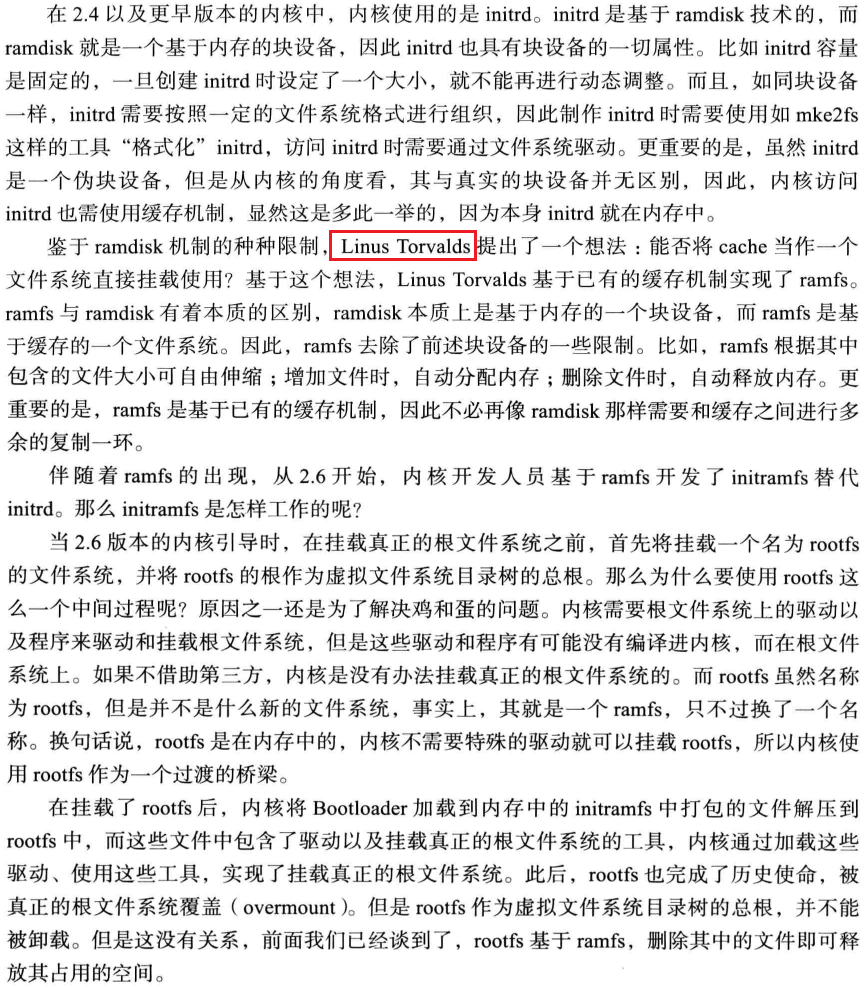

## 挂载rootfs

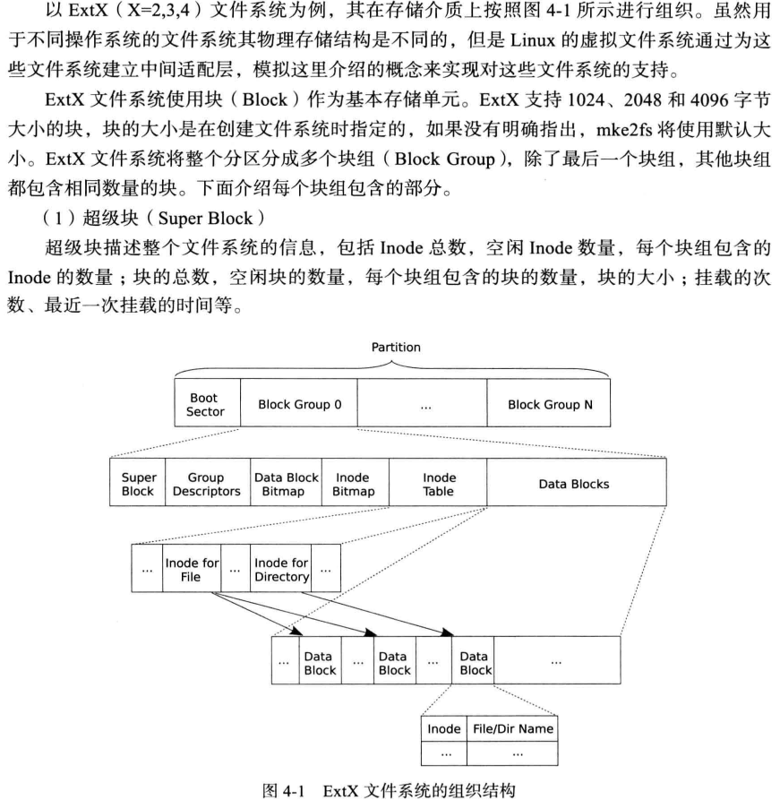

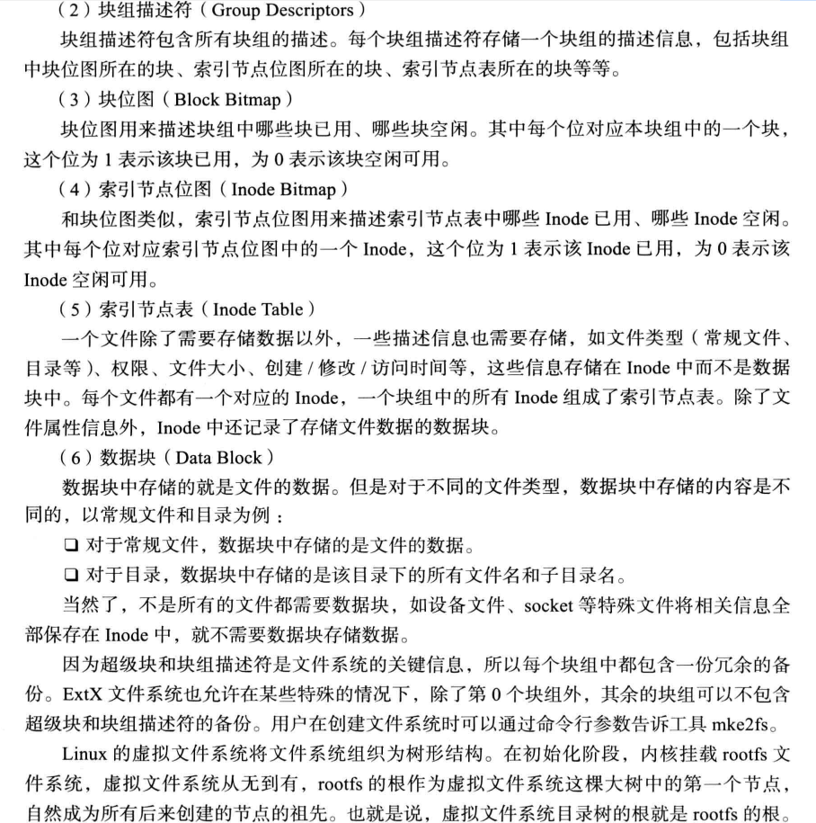

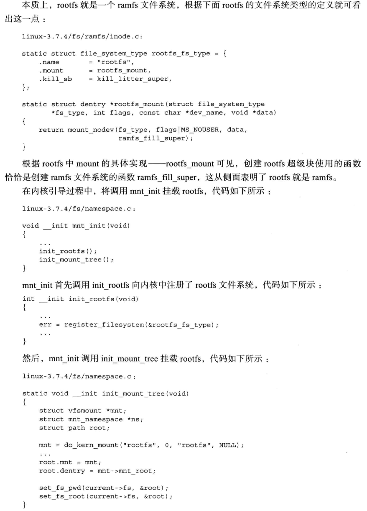

挂载rootfs的过程是由 do_kern_mount 来完成的，该函数工作包含以下几个方面：

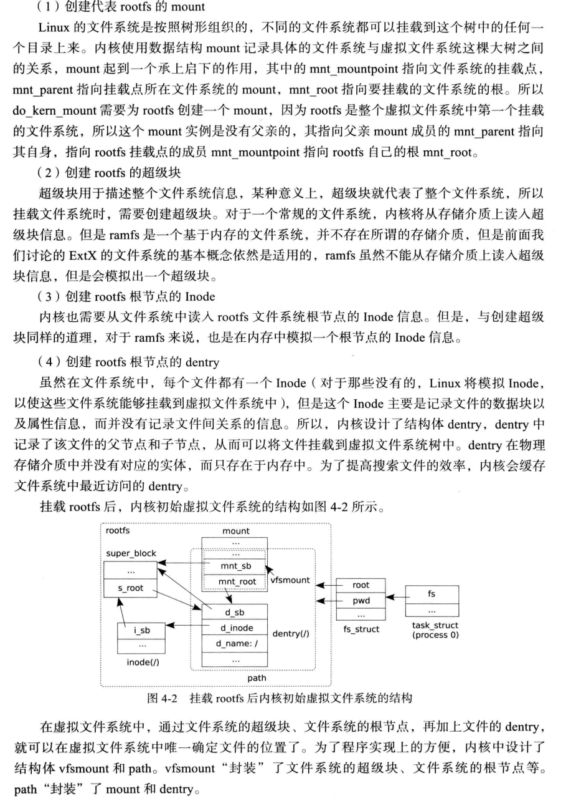

书上还提到了名称空间namespace


## 解压initramfs到rootfs


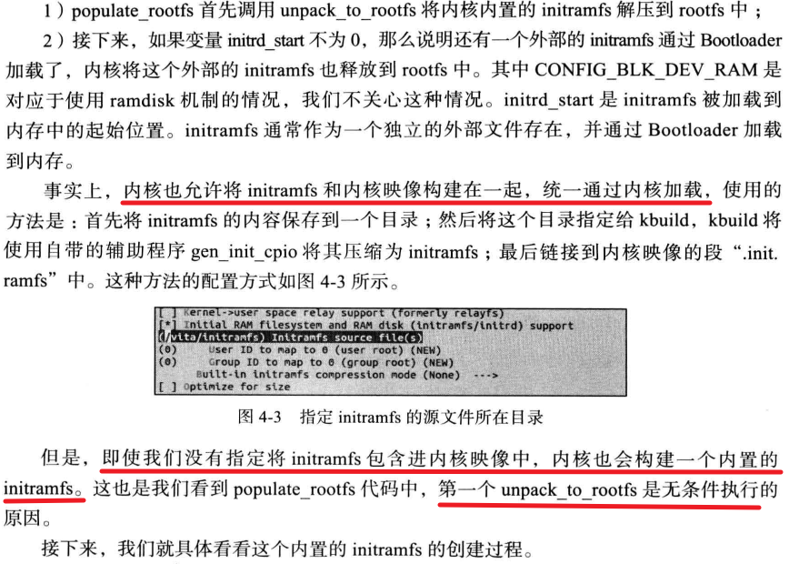


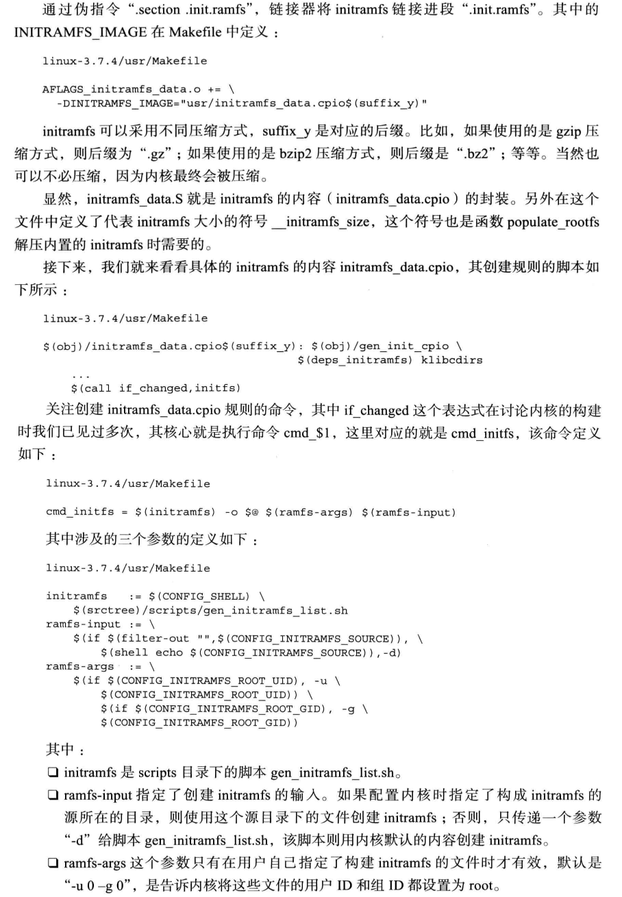

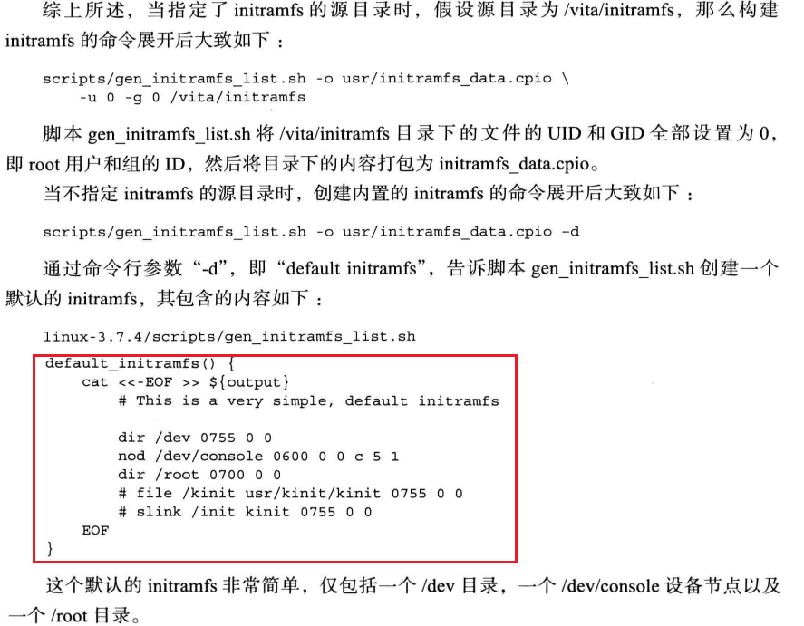

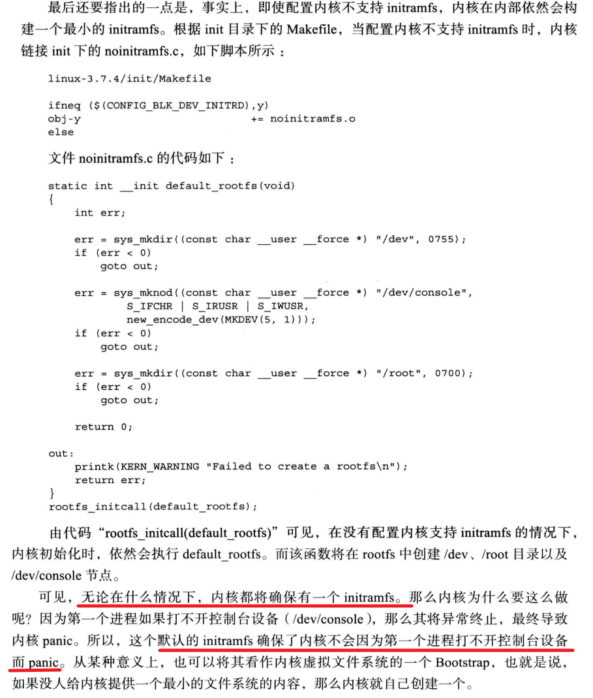

* panic是英文中是惊慌的意思，Linux Kernel panic正如其名，linux kernel不知道如何走了，它会尽可能把它此时能获取的全部信息都打印出来。
* 启动过程尽可能输出错误，要输出到console，就要有个/dev/console，那么不管怎样就得有initramfs

## 挂载并切换到真正的根目录

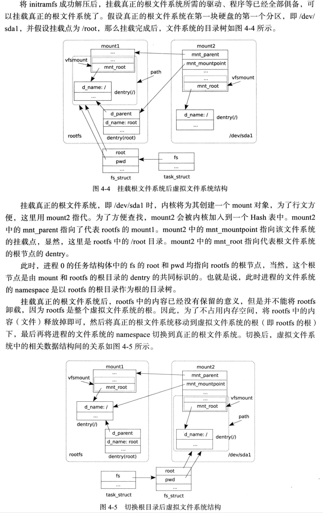

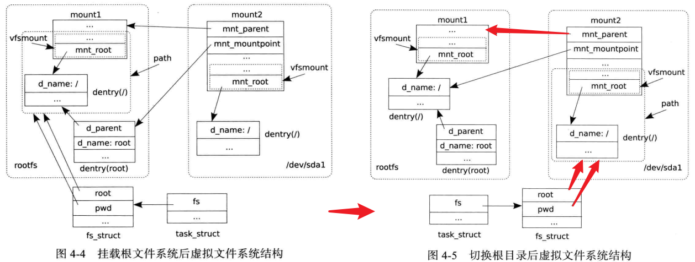

* initramfs在根切换后会被释放掉，也就是说你构建的initramfs进入系统后看不到了
* 你也可以选择不释放掉

---
